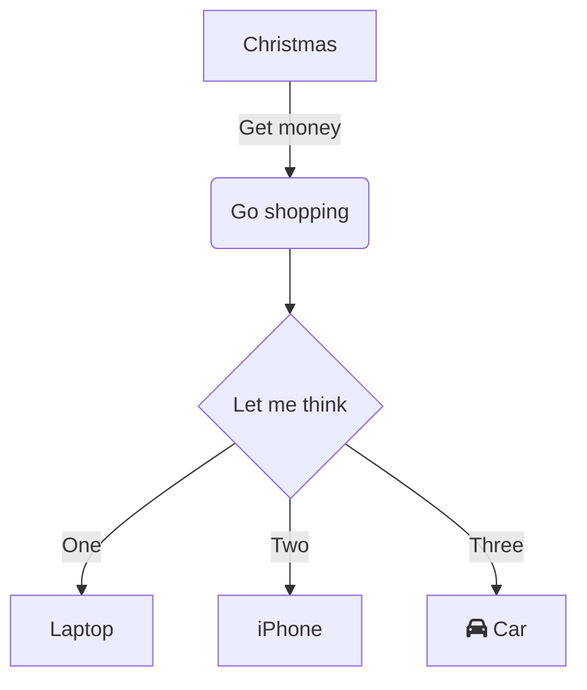

## Introduction

Lorem ipsum



```tact
message (0x123123) TransferMsg {
  to: Address;
  text: String;
}

contract SimpleContract {
  init() {}
  receive() {}
  receive(msg: TransferMsg) {
      send(SendParameters{
          to: msg.to,
          value: 0,
          mode: SendRemainingValue,
          body: msg.text.asComment()
      });
  }
}
```
